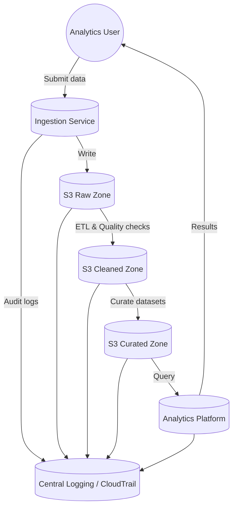

# System Data Flow Diagram

This document provides a high-level data flow diagram (DFD) for the secure AWS data lake platform. The diagram illustrates how data moves through the ingestion account into the raw zone, into curated zones, and ultimately to analytics users, while logging flows to the shared services account.

## Description

1. **Ingestion Service:** Data is ingested via Kinesis, MSK or another ingestion service within the ingestion account. Data is written into the raw zone of the data lake.
2. **Raw Zone (S3):** Raw data is stored in its original format in the raw zone. IAM policies restrict write access to ingestion services and read access to ETL jobs. This aligns with AWS recommendations to organize data into raw, cleaned and curated zones ([docs.aws.amazon.com](https://docs.aws.amazon.com/whitepapers/latest/aws-serverless-data-analytics-pipeline/logical-architecture-of-modern-data-lake-centric-analytics-platforms.html#:~:text=layer%20is%20organized%20into%20the,across%20organizations%20use%20the%20data)).
3. **Cleaned Zone (S3):** ETL jobs running in the ingestion account or analytics account process raw data, perform validation and preliminary transformation, and store results in the cleaned zone. Lifecycle policies move data to infrequent access after a defined period ([docs.aws.amazon.com](https://docs.aws.amazon.com/prescriptive-guidance/latest/defining-bucket-names-data-lakes/data-layer-definitions.html)).
4. **Curated Zone (S3):** Curated data sets are produced for analytics consumption. Access is controlled via IAM roles and Lake Formation tags to enforce least privilege.
5. **Analytics Platform:** Databricks, EMR or other analytics engines in the analytics account consume curated data. Users query via notebooks or BI tools.
6. **Central Logging:** All services send audit logs to the shared services account. CloudTrail, CloudWatch Logs and S3 server access logs support audit and monitoring functions.
